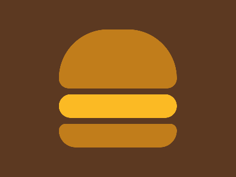

02-02-2024: Required Pattern Match **100%**



```
    <body>
        <div class="top bun"></div>
        <div class="pattie"></div>
        <div class="bottom bun"></div>
    </body>
    <style>
    * {
        margin: 0;
    }

    body{
        background: #5C3921;
        height: 100%;
        width: 100%;
        display: flex;
        flex-direction: column;
        justify-content: center;
        align-items: center;
        gap: 10px
    }

    .pattie{
        width: 200px;
        height: 40px;
        background: #FBBA24;
        border-radius: 25px
    }
    
    .bun {
        width: 200px;
        height: 40px;
        background: #C17D1B;
    }

    .top {
        height: 100px;
        border-radius: 95px 95px 20px 20px
    }

    .bottom {
        border-radius: 10px 10px 30px 30px
    }
    
    </style>
```

