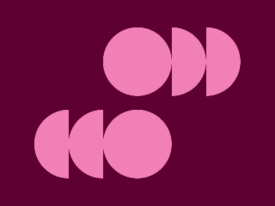

11-02-2024: Required Pattern Match **99.8%**



```
<div class="circle">
  <div class="arc1 t1"></div>
  <div class="arc1 t2"></div>
</div>
<div class="circle">
  <div class="arc2 b1"></div>
  <div class="arc2 b2"></div>
</div>
<style>
  body {
    display: flex;
    height: 95%;
    flex-direction: column;
    align-items: center;
    justify-content: center;
    gap: 20px;
    background: #5F0032;
  }
  .circle {
    border-radius: 50%;
    border-left: 50px solid #F180B6;
    border-right: 50px solid #F180B6;
    border-top: 50px solid #F180B6;
    border-bottom: 50px solid #F180B6;
  }
  .arc1 {
    border-radius: 50%;
    position: absolute;
    border-left: 50px solid transparent;
    border-right: 50px solid #F180B6;
    border-top: 50px solid transparent;
    border-bottom: 50px solid #F180B6;
  }
  .arc2 {
    border-radius: 50%;
    position: absolute;
    border-left: 50px solid #F180B6;
    border-right: 50px solid transparent;
    border-top: 50px solid transparent;
    border-bottom: 50px solid #F180B6;
  }
  .t1 {
    transform:
      translate(0px,-50px)
      rotate(-45deg);
  }
  .t2 {
    transform:
      translate(50px,-50px)
      rotate(-45deg);
  }
  .b1 {
    transform:
      translate(-100px,-50px)
      rotate(45deg);
  }
  .b2 {
    transform:
      translate(-150px,-50px)
      rotate(45deg);
  }
</style>
```

